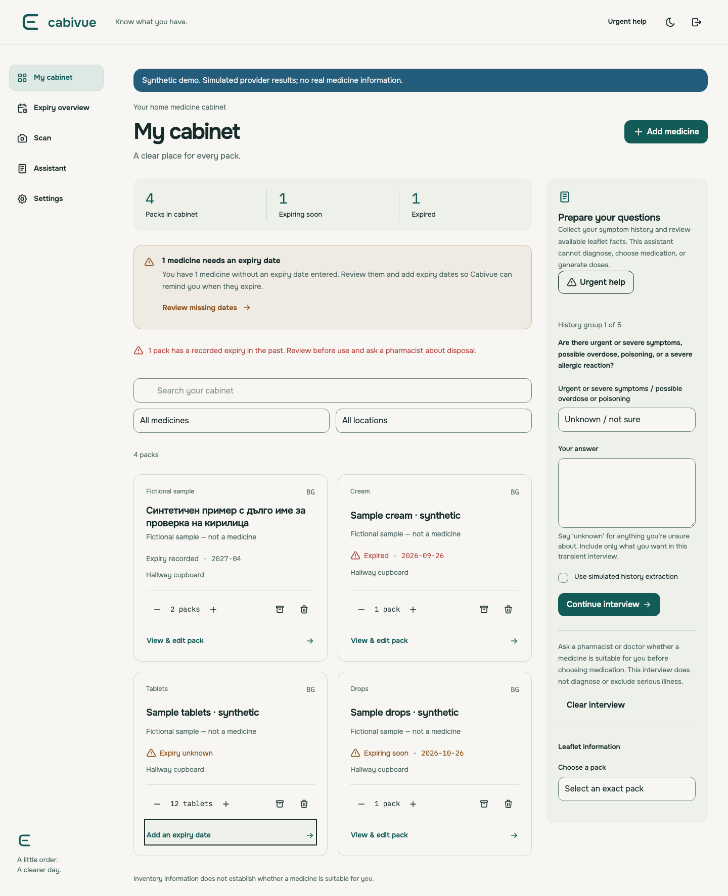

# Cabivue

**Know what you have.** A self-hosted household medicine cabinet. Track physical packs and dates, review scanned labels, and prepare questions for a pharmacist or doctor.

[](https://github.com/OmegaSkiller/CabiVue/actions/workflows/ci.yml)
[Try the public demo](https://omegaskiller.github.io/CabiVue/) · [MIT license](LICENSE) · [Contributing](CONTRIBUTING.md) · [Security](SECURITY.md)

Cabivue is an early open-source release for one household per instance. Inventory works without AI. The optional assistant collects a transient history and displays reviewed general facts when available; it does not diagnose, select treatments, or generate doses. No real medicine catalog is bundled. [Scope and privacy](docs/privacy-and-scope.md) describe the boundaries.

## What works

- Separate products and physical packs, combination ingredients, quantities, storage locations, search, filters, shared-product edits, and confirmed archive/delete.
- Date-only expiry tracking, month-only precision, and reminders when you open the app. Missing dates have a persistent count/review banner, a card warning, and a warning beside the empty field. Reminders are in-app; this release does not send email or push notifications.
- Medicine-photo and receipt scans with previews, consent, editable review, and atomic, idempotent save. Missing expiry stays unknown; a receipt date never becomes expiry.
- Optional session-only OpenAI keys, five interview groups, editable summaries, and fixed urgent help available before login.
- Light/dark branded UI, installable PWA, public-shell caching, and updates that wait for edits. Private records and offline writes are not cached.
- Ten bundled interface languages, including Bulgarian and Arabic RTL, with a persistent language selector. See [localization and translation review status](docs/localization.md).
- Validated plaintext exports and restores with a recovery point before replacement.



[Mobile light](docs/screenshots/cabinet-mobile-light.png) · [Mobile dark](docs/screenshots/cabinet-mobile-dark.png) · [Desktop dark](docs/screenshots/cabinet-desktop-dark.png) · [Empty-expiry warning](docs/screenshots/expiry-warning-desktop.png)

## Development

Use Node 24.20.0 (`nvm use`), then:

```sh
npm ci
npm run setup
cp .env.example .env
npm run dev
```

Read `secrets/bootstrap` locally and use the one-time setup form at http://localhost:5173 to create your household account. The API reads `.env` via Node's environment loader (configured in the development script). No public registration. No AI key is needed for the inventory.

## Docker

```sh
npm run setup
docker compose up --build -d
```

Open http://localhost:3210 and complete setup. SQLite stays in the `cabivue-data` volume. `docker compose down` preserves it; do not add `-v` unless deliberately deleting your data. The final image serves the built frontend and API together as a non-root user.

The volume's actual name has your Compose project prefix. Use `docker volume ls` to identify it. Setup generates a local bootstrap secret; it is never part of the image or repository. If it already exists, keep the existing file.

For phone access, put the service behind an HTTPS reverse proxy. Set `CABIVUE_PUBLIC_ORIGIN` (Compose) or `APP_ORIGIN` (Node) to its exact HTTPS origin, `SECURE_COOKIES=true`, and `TRUST_PROXY` to the proxy's actual IP/CIDR. Change the host port binding only for your intended proxy/network. HTTP on a LAN address does not provide camera/PWA secure-context support.

See [operations](docs/operations.md) for backup, restore, upgrades, HTTPS configuration, and volume retention. Local ARM64 and GitHub Linux AMD64 container checks are tracked separately in [verification](docs/verification.md).

## Public demo

[Open the GitHub Pages demo](https://omegaskiller.github.io/CabiVue/). Changes stay in your current tab and reset on reload. Use synthetic data only; scans and interviews are simulated, with no API keys or backend. See [public demo setup and limitations](docs/public-demo.md).

## Synthetic self-hosted demo

After `npm ci`, run:

```sh
npm run demo
BOOTSTRAP_SECRET_FILE= DATA_DIR=./data/demo-instance DEMO_MODE=true npm run dev
```

Open http://localhost:5173. The sign-in form supplies `demo` / `cabivue-demo-only`. Scans and assistant extraction are simulated and labeled. Use this separate instance only for synthetic data; never expose these credentials or use them with real records. Stop any other development server on the same ports first.

## Optional provider

In Settings, add your OpenAI key for the current session. Each photo/interview request needs deliberate consent. The server uses the fixed official endpoint and pinned `gpt-4.1-mini-2025-04-14` model with structured output, timeouts, and request limits. The key clears on removal, logout, expiry, restore, or restart.

Tests and demo mode make no billable calls. Live OCR quality and clinical behavior have not been evaluated. See [provider evaluation](docs/provider-evaluation.md); a structured response does not prove extraction accuracy.

## Checks

```sh
npm run check
npm run test:e2e
npm run test:pwa
npm run test:pages
npm run format:check
npm audit
docker build -t cabivue:verification .
npm run test:docker
```

`test:pwa` uses the production build from `check`. Browser tests create disposable synthetic databases. The Docker check owns uniquely named disposable containers/volumes and removes them afterward. CI runs formatting, types, unit/API tests, build, production dependency audit, browser/PWA tests, and container persistence/recovery checks.

## Project ownership

```text
src/contracts/  shared runtime schemas and types
src/domain/     calendar, import, and interview invariants
src/server/     authorization, SQL, media, provider, and API
src/web/        React interactions and branded components
migrations/    numbered transactional SQL migrations
prompts/       separate assistant and image-extraction instructions
tests/         synthetic domain/API/provider/browser/PWA proof
scripts/       setup, demo, and disposable verification runners
docs/          architecture, operations, privacy, and evidence
brandkit/      supplied canonical identity and asset provenance
```

[Architecture](docs/architecture.md) explains the database and trust boundaries. [Third-party notices](THIRD_PARTY_NOTICES.md) preserve font/dependency licensing and distinguish code licensing from medicine-source permissions. Public contributions must use synthetic records and fixtures.
